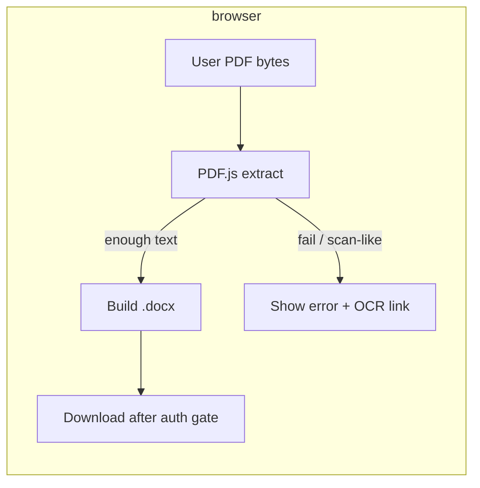

# PDF to Word — client-only conversion (no server upload)

**Status:** Design (approved direction: option **B** — no upload for conversion)  
**Date:** 2026-04-22  
**Supersedes for this tool:** Server fallback sections in `2026-04-22-pdf-to-word-hybrid-client-design.md` — that document stays valid for historical context; **this spec** is the source of truth for PDF→Word routing policy going forward.

## Goal

Deliver **PDF → `.docx` entirely in the browser** so the **PDF bytes never leave the device** for conversion (aligned with competitor UX: “processed on your device”). When conversion cannot succeed locally, **do not** call `POST /document-flow/convert-pdf-to-docx`; instead surface a **clear error** and direct users to **OCR** (`/tools/ocr-pdf`) when the PDF likely has **no extractable text** (scans).

## Non-goals

- **LibreOffice-class fidelity** in the browser for every PDF — still out of scope; client output remains **best-effort**.
- **Guaranteeing** OCR inside this tool — OCR stays on the **OCR PDF** tool / API unless a separate project adds client-side Tesseract.

## User-visible behavior

1. User selects a PDF (same entry point as today).
2. **Only path:** Parse with **PDF.js** in-tab → extract content → build **`.docx`** → download after the usual **sign-in gate** when accounts apply.
3. **On success:** Success copy emphasizes **local processing** (no conversion upload).
4. **On failure:**
   - **Little or no extractable text** (typical scan): Message explains the PDF may be image-based; **link to `/tools/ocr-pdf`**; suggest downloading an OCR’d PDF and trying again **or** editing in **Edit PDF** if applicable.
   - **File too large / too many pages:** Hard caps with explicit numbers (reuse or tighten existing `CLIENT_PDF_MAX_BYTES` / `CLIENT_PDF_MAX_PAGES`).
   - **Parse / worker / OOM error:** Short technical hint (“try a smaller file”) without implying server conversion exists.

**There is no** automatic or hidden **server conversion** step for this tool.

## Architecture

| Unit | Responsibility |
|------|----------------|
| **Extraction** | PDF.js `getDocument` → per-page `getTextContent()`. **Phase 1 (minimal change):** retain concatenated plain text compatible with current `buildMinimalDocxBlob`. **Phase 2 (optional improvement):** walk **items** with transforms/fonts to build **richer** `docx` paragraphs/runs (competitor-style), still fully client-side. |
| **`buildMinimalDocxBlob`** / **`docx` builders** | Produce valid `.docx` `Blob`; extend only if Phase 2 is in scope. |
| **`PdfToWordPage.jsx`** | Remove **`fetchServerDocx`** usage and **capabilities** checks whose sole purpose is enabling server fallback. Optional: **hide** or **simplify** `/document-flow/capabilities` fetch if only used for PDF→Word server flags. Keep **`runWithSignInForDownload`**. |
| **Backend** | **`POST /document-flow/convert-pdf-to-docx`** remains on the server for **other clients or future tools**; **this page does not call it**. |

## Data flow

## Analytics

- **`pdf_to_word_path`:** only **`client`** or omit server dimension entirely.
- **`pdf_to_word_failed`:** `{ reason: 'insufficient_text' | 'size_limit' | 'page_limit' | 'client_error' }` (names aligned with existing `pdf_to_word_client_skipped` buckets where possible).
- Remove or stop emitting events that imply **server** conversion from this page.

## Errors & accessibility

- **`role="alert"`** for blocking errors; OCR link must be a real **`<Link>`** with visible focus styles.
- Do **not** claim “no data leaves device” if analytics or auth still talk to your API — marketing copy should say **conversion** stays local, not “nothing ever hits the network.”

## Testing

- **Text PDF:** produces `.docx`; **Network** tab shows **no** `convert-pdf-to-docx` **POST** with PDF body.
- **Scan PDF:** friendly message + OCR link; **no** server conversion request.
- **Over limit:** clear message without server retry.

## Operator / docs

- Update **tool SEO**, **registry**, and **matrix** (`browser-server-conversion-matrix`) to state PDF→Word is **client-only** for pdfpilot **SPA** (no conversion upload).
- Self-hosted operators should not expect PDF→Word to exercise LibreOffice through this route anymore.

## Self-review

| Check | Result |
|-------|--------|
| Placeholders | None |
| Consistency | Policy B explicit; hybrid doc explicitly superseded for routing |
| Scope | Single tool behavior + optional Phase 2 richness |
| Ambiguity | “Conversion” local vs analytics/auth calls distinguished in copy |
