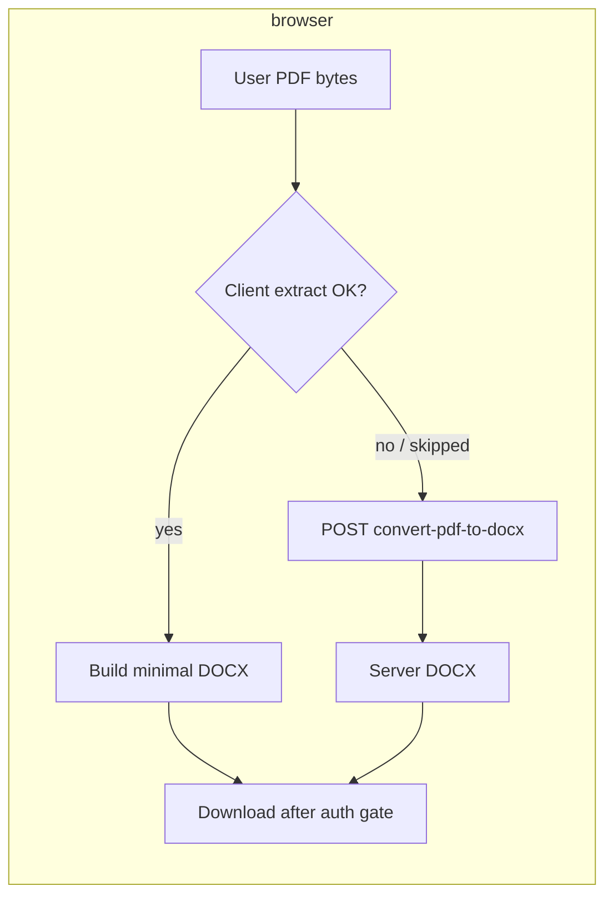

# PDF to Word — hybrid (browser-fast + server fallback)

**Status:** Design (approved direction: option **A** — hybrid)  
**Date:** 2026-04-22  

## Goal

Deliver **near-instant PDF → `.docx`** for typical **text-based PDFs** by running conversion **in the browser** (same pattern as competing tools: PDF.js + DOCX packaging), while **keeping** the existing **server route** (`POST /document-flow/convert-pdf-to-docx`) for cases where browser conversion is weak or unsuitable.

## Context

- Today **`PdfToWordPage`** uploads to the API and depends on LibreOffice/Docker; that path optimizes for **fidelity** and **complex layouts**, not **latency**.
- Competitor behavior observed: load **PDF.js**, **JSZip**, generate **`.docx`** locally — **no round-trip** for the heavy work, hence **sub-second** feel on small files.

## User-visible behavior

1. User selects a PDF (same dropzone as today).
2. **Primary path (client):** The app tries to extract **embedded text** via **pdf.js** (already used elsewhere in the repo), assemble a **minimal `.docx`** (structured paragraphs; **not** full layout fidelity), and trigger download after the usual **sign-in gate** for downloads.
3. **Fallback path (server):** If the client path **declines** (see rules below) or **fails**, the app **automatically** falls back to the **existing** API conversion — **no extra button required** by default. Optional **advanced** toggle: “Prefer server conversion” for power users (optional — only if UX stays simple).
4. **Scanned / image-only PDFs:** If extracted text is **empty or trivial**, show a clear message: run **OCR PDF** first (link to `/tools/ocr-pdf`), then try again — rather than silently uploading a huge bitmap PDF to the server.

## Decision rules (client vs server)

**Try client first** when:

- File size under a configurable ceiling (e.g. **≤ 15–25 MB** raw bytes) to protect mobile browsers.
- Page count under a ceiling (e.g. **≤ 100 pages**) or total extracted characters within limits.

**Skip client and use server directly** when (examples):

- User enabled **“Prefer server conversion”** (if implemented).
- Client extraction yields **no meaningful text** (likely scan) — **do not** waste server cycles without user intent; prompt OCR instead.
- Client throws (OOM, worker failure) — fallback to server once, then surface error.

Exact thresholds are **implementation constants** with sane defaults; tune after QA.

## Architecture

| Piece | Responsibility |
|--------|----------------|
| **`pdfToWordClient.js`** (new, `frontend/src/lib/` or `features/pdf-to-word/`) | Load PDF bytes → pdf.js `getDocument` → per-page text via `getTextContent` → concatenate with page breaks → return `{ text, meta }` or failure reason. |
| **`buildDocxFromPlainText.js`** (new) | Input: UTF-8 string → output: **`Blob`** / `Uint8Array` of a valid minimal `.docx` using **`docx`** (bundled for browser) or equivalent zip+xml builder already aligned with project tooling. |
| **`PdfToWordPage.jsx`** | Orchestrate: `busy` states (“Converting in your browser…” vs “Sending to server…”); analytics **client vs server** outcome; reuse **`runWithSignInForDownload`**. |
| **Existing API** | Unchanged contract; used only on fallback. |

## Data flow

## Quality & expectations

- **Client `.docx`:** Best-effort **paragraphs** from text content order; **tables, headers/footers, complex formatting** may be **flattened or partial**. Marketing / helper copy must say **fast draft**, not **pixel-perfect Word**.
- **Server `.docx`:** Continues to represent **LibreOffice-class** conversion when reached.

## Analytics

- Extend **`pdf_to_word`** events with a dimension or property: `conversion_path: 'client' \| 'server' \| 'failed'`.
- Track client failures before fallback (reason bucket: empty_text, size_limit, exception).

## Errors & accessibility

- Loading **pdf.js worker** from **same-origin** or **Vite-bundled** worker URL (avoid blocking third-party CDNs if CSP tight).
- Errors surfaced via **`role="alert"`** consistent with current page.
- Large files: progressive UI (“Processing page N…”) optional for v2.

## Testing

- Unit: text extraction from a tiny synthetic PDF fixture (committed **without** secrets).
- Manual: text PDF → client path fast; scan PDF → OCR prompt; large PDF → server fallback or explicit limit message.

## Non-goals (this iteration)

- Replacing server conversion entirely.
- Full **layout-preserving** client PDF→Word (would require WASM layout engines or unacceptable bundle size).

## Open questions (resolved for v1)

| Question | Resolution |
|----------|------------|
| Hybrid vs client-only? | **Hybrid** — client first, server fallback. |
| Toggle for server-only? | **Optional** later; v1 can be automatic. |

---

**Next step:** Implementation plan (`writing-plans` skill) — chunk loading for pdf.js + docx, wiring `PdfToWordPage`, analytics, and copy updates in **`toolSeoContent`** / tool subtitle if needed.
